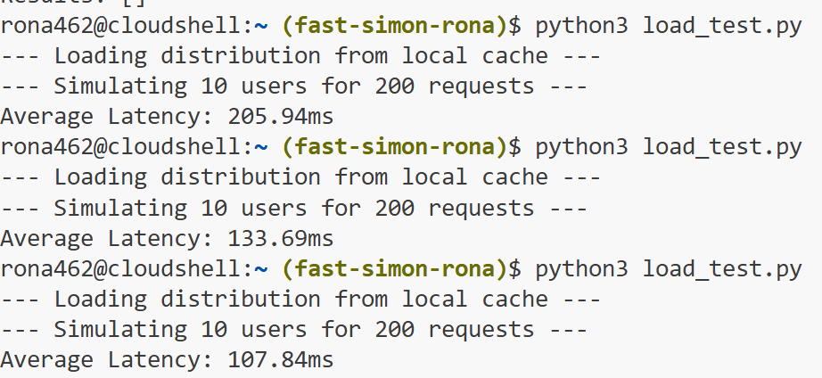

# Fast Simon Hiring Challenge - Related Queries API
**Submitted by:** Rona Lavi

## Project Overview
This project implements a high-performance "Related Queries" API designed to handle 1 million search logs and provide real-time recommendations with low latency. The pipeline processes raw data in BigQuery, ingests it into Datastore, and serves it via a Flask application on Google App Engine.

---

## 1. Data Preprocessing (SQL)
The preprocessing was performed in **Google BigQuery** to handle large-scale data transformation.

*Visualizing the extraction logic and Jaccard results directly in the BigQuery console.*

### Key Logic Features:
* **Stemming:** Used `REGEXP_REPLACE` to standardize query variations (e.g., 'hoodie' and 'hoodies'), ensuring diverse top-K results.
* **Noise Filtering:** Queries shorter than 3 characters (e.g., 'a', 'to') were excluded using `LENGTH(related_query) > 2`.
* **Jaccard Similarity:** Implemented to prevent popularity bias by calculating the intersection over union:
  $$J(A, B) = \frac{|A \cap B|}{|A \cup B|}$$
* **Reliability Threshold:** Only query pairs appearing together in **at least 2 sessions** (`HAVING COUNT > 1`) were considered to ensure statistical significance.
* **Symmetry:** Bidirectional relationships were assumed to maximize recommendation coverage.

## 2. Data Ingestion & Storage
* **Storage:** Used **Google Cloud Datastore** for its high scalability and sub-50ms internal retrieval capabilities.
* **Key Design:** The search query itself is used as the **Datastore Key**, enabling $O(1)$ lookup complexity during API requests.

## 3. GAE Application (The API)
The API is a **Python Flask** application deployed on **Google App Engine** in the **US region** (Project: `rona-455616`).

### Performance Optimizations:
* **LRU Caching:** An in-memory cache (size 5000) was implemented to cover the dataset (~3000 keys), significantly reducing Datastore read costs and latency.
* **Anti-Cold Start:** Configured `min_idle_instances: 1` in `app.yaml` to maintain steady performance.

## 4. Performance & Load Testing
System efficiency was verified through load tests simulating 10 concurrent users for 200 requests.

*Results show a clear **warm-up effect**: as the LRU cache populates, average latency drops to **107.84ms** (including Network RTT).*

---

## Project Structure
- `main.py`: Flask API implementation.
- `app.yaml`: App Engine configuration.
- `ingest_data.py`: Script to populate Datastore from BigQuery.
- `load_test.py` & `test_api.py`: Performance and functional testing suites.
- `extract_related_queries.sql`: Core BigQuery data processing logic.
